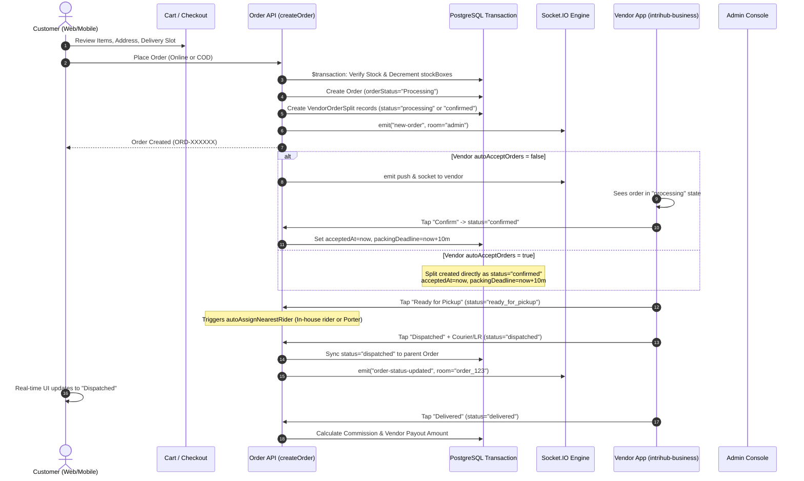
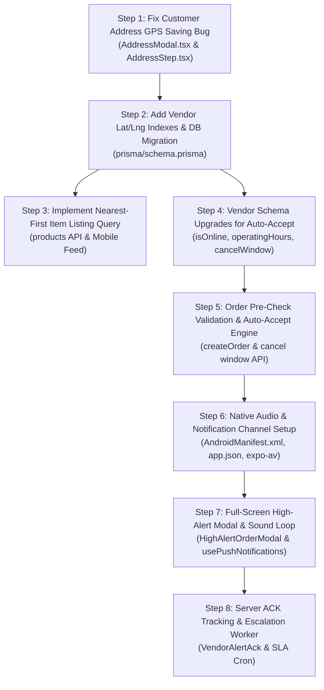

# Technical Codebase Architecture & Feature Planning Notes
**Repository**: `intrihub` (Monorepo root: `d:\Intrihub`)  
**Document**: `CODEBASE_NOTES_intrihub.md`  
**Mode**: READ-ONLY Audit & Future Feature Blueprint  
**Date**: October 2026  

---

## Executive Overview

### What This Repository Is
`intrihub` is a multi-surface B2B/B2C marketplace platform for building materials, tiles, sanitaryware, and electricals. The codebase is organized as a unified monorepo housing five operational components:

1. **Customer Web Storefront & Portal (`/`, `/shop`, `/checkout-v2`, `/account`)**: Next.js App Router public marketplace featuring instant tile coverage calculators, volume tier pricing, Razorpay checkout, and user order tracking.
2. **Super Admin & CPO Web Portals (`/admin/*`, `/cpo/*`)**: Web consoles for marketplace management. `/admin` handles orders, deliveries, vendor applications, KYC, and catalog approvals. `/cpo` is a scoped portal for the Chief Product Officer covering catalog taxonomy, pricing tiers, and merchandising.
3. **Vendor Web Portal (`/vendor/*`)**: Web workspace for onboarded merchants to track splits, manage product inventory, update fulfillment statuses, and review payouts.
4. **Customer Mobile Application (`intrihub-mobile/`)**: Standalone React Native (Expo SDK 57) mobile app for iOS and Android end-users and contractors.
5. **Business & Admin Mobile Application (`intrihub-business/`)**: Dual-persona React Native (Expo SDK 57) mobile app that dynamically renders either the **Vendor Partner Portal** or the **Super Admin Console (5-tab)** based on the authenticated user's credentials.
6. **Unified Backend & Event Server (`app/api/*`, `socket-server/`, `server.ts`)**: Next.js Server Actions and REST API routes, paired with a persistent standalone Socket.IO relay server (`socket-server/index.js` running on Node/Express) for real-time order tracking and dispatch alerts.

---

### Tech Stack & Framework Versions

| Component | Framework / Runtime | Core Libraries & Versions |
|---|---|---|
| **Root Web & API** | Next.js `16.2.10` (App Router), React `19.2.4`, Node.js | `@prisma/client: ^6.19.3`, `tailwindcss: ^4`, `razorpay: ^2.9.8`, `resend: ^6.20.0`, `socket.io: ^4.8.3`, `socket.io-client: ^4.8.3`, `zustand: ^5.0.15`, `zod: ^4.4.3`, `@sentry/nextjs: ^10.74.0` |
| **Customer Mobile (`intrihub-mobile`)** | React Native `0.86.3`, Expo SDK `~57.0.0`, Expo Router `~57.0.23` | `expo-location: ~57.0.20`, `expo-notifications: ~57.0.21`, `react-native-razorpay: ^3.0.0`, `@tanstack/react-query: ^5.66.0`, `zustand: ^5.0.3`, `socket.io-client: ^4.8.1` |
| **Business Mobile (`intrihub-business`)** | React Native `0.86.3`, Expo SDK `^57.0.0`, Expo Router `~57.0.22` | `expo-location: ~57.0.19`, `expo-notifications: ~57.0.20`, `@tanstack/react-query: ^5.66.0`, `zustand: ^5.0.3`, `@sentry/react-native: ^8.27.0`, `socket.io-client: ^4.8.1` |
| **Real-Time Relay (`socket-server`)** | Node.js, Express `^4.21.2` | `socket.io: ^4.8.1`, `cors: ^2.8.5`, `dotenv: ^16.4.7` |
| **Database** | PostgreSQL | Queried through Prisma ORM `6.19.3` (`DATABASE_URL` pooler + `DIRECT_URL`) |

---

### Directory & Monorepo Structure

```text
d:\Intrihub\
├── app/                                 # Next.js 16 App Router
│   ├── (auth)/                          # Customer web authentication
│   ├── (shop)/                          # Public storefront catalog browsing
│   ├── account/                         # Customer web account, orders, addresses
│   ├── admin/                           # Super Admin web dashboard (/admin/*)
│   ├── cpo/                             # Chief Product Officer web portal (/cpo/*)
│   ├── vendor/                          # Vendor merchant web portal (/vendor/*)
│   ├── checkout-v2/                     # Multi-step quick commerce checkout
│   └── api/                             # REST API endpoints
│       ├── mobile/                      # Mobile API Gateway (auth, products, orders, vendor, push-token)
│       ├── geo/                         # Google Places & Geocoding proxy routes (autocomplete, reverse-geocode)
│       ├── cron/                        # Scheduled server tasks (sla-checker)
│       └── webhooks/                    # Razorpay payment & logistics webhooks
├── components/                          # React client & server components
├── hooks/                               # Web React hooks
├── lib/                                 # Central business logic and service layer
│   ├── actions/                         # Reusable domain actions (orders, products, vendor, auth, addresses)
│   ├── delivery/                        # Geo-fencing & routing (geo.ts, config.ts)
│   ├── push-notifications.ts            # Expo push notification dispatcher
│   ├── socket-server-emit.ts            # Socket.IO room broadcast bridge
│   ├── mobile-auth.ts                   # HMAC Bearer JWT generator & verifier
│   └── prisma.ts                        # Global Prisma client instance
├── prisma/
│   └── schema.prisma                    # PostgreSQL schema definition (1,505 lines)
├── socket-server/                       # Standalone WebSocket relay server (Port 4001)
├── intrihub-mobile/                     # Customer Mobile Application (Expo SDK 57)
│   ├── app/                             # Expo Router file screens (home, explore, checkout, order/[id])
│   ├── src/store/                       # Zustand stores (authStore, locationStore, cartStore)
│   ├── src/components/                  # AddressModal, MapPickerModal, Header
│   └── app.json                         # Mobile app manifest & permissions
└── intrihub-business/                   # Dual-Persona Business & Admin Mobile App (Expo SDK 57)
    ├── app/
    │   ├── (admin)/                     # Super Admin Console (5 tabs: Dashboard, Vendors, Items, Orders, Account)
    │   └── (vendor)/                    # Vendor Partner Portal (5 tabs: Dashboard, Items, Orders, Earnings, Store)
    ├── src/hooks/                       # usePushNotifications.ts
    ├── android/app/src/main/            # Native AndroidManifest.xml
    └── app.json                         # Vendor app manifest, notification channels, permissions
```

---

### Interconnections & External Services
- **Database**: PostgreSQL hosted via cloud instance, connected through Prisma ORM using connection pooler (`DATABASE_URL`) and direct connection (`DIRECT_URL`).
- **Web Sessions**: Cookie-based HMAC signed session tokens (`intrihub_session`, `intrihub_admin_token`, `intrihub_cpo_token`).
- **Mobile Authentication**: Stateless Bearer tokens signed with HMAC-SHA256 via secret in `.env` (`MOBILE_JWT_SECRET`).
- **Payment Processing**: **Razorpay** SDK (`razorpay: ^2.9.8`) on Web; native `react-native-razorpay` bridge on mobile. Payments verified via cryptographic HMAC signatures against webhook and checkout secrets.
- **Push Notifications**: **Expo Push API** (`https://exp.host/--/api/v2/push/send`) dispatched by `lib/push-notifications.ts` using tokens stored in the database.
- **Real-Time Sockets**: Standalone Express Socket.IO server (`socket-server/index.js`) listening on port 4001, bridged via HTTP `POST /emit` from Next.js backend (`lib/socket-server-emit.ts`). Clients connect to rooms `order_{orderId}`, `vendor_{vendorId}`, and `admin-room`.
- **Email Delivery**: **Resend** transactional email API configured via secret in `.env` (`RESEND_API_KEY`) for customer/vendor 6-digit OTP codes and invoices.
- **WhatsApp Integration**: Meta Cloud API integration in `lib/autobot/whatsapp.ts` sending outbound template messages using credentials stored in `.env`.

---

## A. Address and Location

### 1. Address Selector Mechanics

#### Customer Mobile App (`intrihub-mobile`)
- **Components & Files**:
  - [AddressModal.tsx](file:///d:/Intrihub/intrihub-mobile/src/components/AddressModal.tsx) (Component: `AddressModal`)
  - [Header.tsx](file:///d:/Intrihub/intrihub-mobile/src/components/Header.tsx) (Component: `Header`)
  - [home.tsx](file:///d:/Intrihub/intrihub-mobile/app/(tabs)/home.tsx) (Component: `HomeScreen`)
  - [MapPickerModal.tsx](file:///d:/Intrihub/intrihub-mobile/src/components/MapPickerModal.tsx) (Component: `MapPickerModal`)
  - [locationStore.ts](file:///d:/Intrihub/intrihub-mobile/src/store/locationStore.ts) (Hook/Store: `useLocationStore`)
  - [authStore.ts](file:///d:/Intrihub/intrihub-mobile/src/store/authStore.ts) (Hook/Store: `useAuthStore`)
- **State & Storage**:
  - Active selected address is held in `useAuthStore.getState().selectedAddress` and persisted to mobile storage via `@react-native-async-storage/async-storage` under key `intrihub_selected_address`.
  - When the user launches the app or taps the location selector in [Header.tsx](file:///d:/Intrihub/intrihub-mobile/src/components/Header.tsx#L114-L125), `setAddressModalVisible(true)` opens `AddressModal`.
- **Modes of Selection**:
  1. *Saved Addresses*: Fetched via `GET /api/addresses` and backfilled from customer past orders (`getOrders()`). Clicking an existing card updates `setSelectedAddress(item)` and stores it in AsyncStorage.
  2. *Current Location (GPS)*: Calls `useLocationStore.getState().getQuickLocation()`. Tries `Location.getLastKnownPositionAsync()` first, then falls back to `Location.getCurrentPositionAsync({ accuracy: Location.Accuracy.Balanced })`. Coordinates are reverse-geocoded against Google Maps Geocoding API (`maps.googleapis.com/maps/api/geocode/json?latlng=...`) with native `Location.reverseGeocodeAsync()` as fallback.
  3. *Search (Autocomplete)*: Debounced text input hits `GET /api/geo/autocomplete?input=...` and fetches place coordinates via `GET /api/geo/place-details?placeId=...`.
  4. *Map Pin*: Opens `MapPickerModal` displaying a full-screen map with draggable target pin.
- **What is Saved**:
  - The in-memory `Address` TypeScript interface includes `latitude?: number | null`, `longitude?: number | null`, `accuracy?: number | null`, `source?: string`.
  - **CRITICAL IMPLEMENTATION GAP / BUG**: In `intrihub-mobile/src/components/AddressModal.tsx` lines 478-510 (update mode) and lines 534-548 (create mode), the payload sent to `POST /api/addresses` includes `label, fullName, phone, houseNumber, street, area, landmark, city, state, pincode, deliveryInstructions, isDefault`. **`latitude`, `longitude`, `accuracy`, and `source` are omitted from the POST/PATCH payload**. Thus, addresses created through the mobile UI only persist text in PostgreSQL, even though GPS was captured in mobile memory.

#### Customer Web Storefront (`app/`)
- **Components & Files**:
  - [AddressStep.tsx](file:///d:/Intrihub/components/checkout-v2/AddressStep.tsx) (Component: `AddressStep`)
  - [WebMapPickerModal.tsx](file:///d:/Intrihub/components/maps/WebMapPickerModal.tsx) (Component: `WebMapPickerModal`)
  - [auth-store.ts](file:///d:/Intrihub/lib/auth-store.ts) (Store: `useAuthStore`)
  - [addresses.ts](file:///d:/Intrihub/lib/actions/addresses.ts) (Server Actions: `getUserAddresses`, `saveAddress`)
- **State & Storage**:
  - Stored in browser `localStorage` under `intrihub-customer-auth` via Zustand persist middleware.
  - Calling `addAddress()` dispatches background persistence to PostgreSQL via `saveUserAddress(userId, newAddress)` or `saveAddress()`.
- **What is Saved**:
  - Full text fields (`houseNumber`, `line1`, `line2`, `city`, `state`, `pincode`, `landmark`).
  - Browser geolocation (`navigator.geolocation.getCurrentPosition`) saves temporary coordinates in `sessionStorage` under `last_coords`, but `AddressStep.tsx` line 318 does not pass `latitude` and `longitude` into `addAddress()`. Coordinates are therefore lost on web checkout address saves unless entered via map confirm.

---

### 2. Storage of Coordinates

| Entity | Schema Table | Latitude Field | Longitude Field | Accuracy Field | Source Field | Index |
|---|---|---|---|---|---|---|
| **Customer Address** | `Address` | `latitude Float?` | `longitude Float?` | `accuracy Float?` | `source String @default("GPS")` | `@@index([latitude, longitude])` |
| **Order Snapshot** | `Order` | `deliveryLatitude Float?` | `deliveryLongitude Float?` | `deliveryAccuracy Float?` | `deliveryLocationSource String?` | `@@index([deliveryLatitude, deliveryLongitude])` |
| **Vendor Pickup Location** | `Vendor` | `latitude Float?` | `longitude Float?` | `locationAccuracy Float?` | None | None (Missing geo-index on Vendor table) |
| **Delivery Partner** | `DeliveryPartner` | `currentLatitude Float?` | `currentLongitude Float?` | `currentAccuracy Float?` | None | None |

**Analysis**:
- Both customer address records and vendor locations have dedicated floating-point coordinate columns in PostgreSQL schema (`prisma/schema.prisma`).
- `Address` has a composite database index `@@index([latitude, longitude])`.
- `Vendor` **DOES NOT have a database index on `[latitude, longitude]`**.
- Customer coordinates are frequently null in the database because the mobile address creation form in `AddressModal.tsx` fails to include `latitude` and `longitude` in the network request body.

---

### 3. Existing Distance, Radius, Geo-Query & Service-Area Logic

1. **Haversine Distance Calculator**:
   - File: [geo.ts](file:///d:/Intrihub/lib/delivery/geo.ts)
   - Function: `haversineDistanceKm(lat1, lon1, lat2, lon2)`
   - Computes great-circle distance in kilometers using `EARTH_RADIUS_KM = 6371`. Completely synchronous, runs in `< 1ms`.
   - Function: `findNearest(refLat, refLng, candidates)` iterates through candidates with `{ latitude, longitude }` and returns the candidate with the lowest `distanceKm`.
   - Function: `filterWithinRadius(refLat, refLng, candidates, radiusKm)` filters candidates by distance and sorts ascending.

2. **Geo-Vendor Lookup**:
   - File: [geo-vendor.ts](file:///d:/Intrihub/lib/actions/geo-vendor.ts)
   - Functions: `findNearestVendorByProduct(productId, customerLat, customerLng)` and `findNearestVendorBatch(productIds, customerLat, customerLng)`.
   - Logic: Queries the database for the product, validates that `vendor.status === "approved"`, and checks vendor coordinates. If vendor coordinates are null, it degrades gracefully to direct assignment.
   - **Current limitation**: The comment in lines 67-68 notes: *"Today's model: one product -> one vendor. Single-vendor path: return vendorId directly."* Shared SKU multi-vendor assignment is planned in comments but does not yet evaluate candidates across multiple vendors.

3. **Vendor Service Area Radius**:
   - Field: `Vendor.serviceAreaRadiusKm Float @default(10)` in `prisma/schema.prisma` line 979.
   - Updatable via: `POST /api/mobile/vendor/profile` ([profile/route.ts](file:///d:/Intrihub/app/api/mobile/vendor/profile/route.ts#L135-L137)) with clamp between 1 and 50 km.
   - **Does enforcement logic exist?** **NO**. In `findNearestVendorByProduct` and `findNearestVendorBatch`, `serviceAreaRadiusKm` is read in the select query but **never checked** against `distanceKm`. Orders placed outside the vendor's radius are neither rejected nor flagged.

4. **Rider Auto-Assignment Radius**:
   - File: [rider-assignment.ts](file:///d:/Intrihub/lib/actions/rider-assignment.ts)
   - Searches for available in-house riders within `DELIVERY_CONFIG.RIDER_SEARCH_RADIUS_KM = 5` km using `filterWithinRadius()`.

---

## B. Item Listing

### 1. Catalog Listing APIs and Queries

There are two primary item listing endpoints in the codebase:

#### Web Storefront Query
- File: [products.ts](file:///d:/Intrihub/lib/actions/products.ts)
- Function: `getProducts(options)`
- Server Route: `GET /api/products` ([products/route.ts](file:///d:/Intrihub/app/api/products/route.ts))
- **Prisma Query**:
  ```ts
  prisma.product.findMany({
    where: {
      status: "active",
      approvalStatus: "approved",
      categorySlug: options.categorySlug,
      // optional filters: isTrending, isBestseller, isNewArrival, inStock, search
    },
    include: {
      variants: true,
      attributes: true,
      priceTiers: true,
      vendor: {
        select: { id: true, businessName: true, status: true }
      }
    },
    orderBy: { createdAt: "desc" },
    take: limit,
    skip: skip,
  })
  ```
- **Caching**: Web homepage sections (`getHomepageSections()`) use an in-memory `Map<string, { data: Product[], timestamp: number }>` with a 3-minute TTL (`PRODUCT_SECTION_CACHE_TTL = 180000`).

#### Mobile REST API
- File: [route.ts](file:///d:/Intrihub/app/api/mobile/products/route.ts)
- Endpoint: `GET /api/mobile/products`
- **Supported Parameters**:
  - Search: `q`, `search`, `query` (tokenized multi-word case-insensitive ILIKE search across `name`, `description`, `categoryName`, `categorySlug`, `subcategory`, `material`, `finish`, `look`, `usage`).
  - Filtering: `category` / `categorySlug`, `subcategory`, `minPrice`, `maxPrice`, `finish`, `material`, `vendorId`, `trending`, `bestseller`, `newArrival`.
  - Sorting (`sort`): `popular` (default: sorts by `isTrending desc, isBestseller desc, rating desc`), `price_asc`, `price_desc`, `rating`.
  - Pagination: `page` (default 1), `limit` (default 40, clamped to 250).
- **Client Cache**: On the customer mobile app, queries are cached in React Query (`useInfiniteQuery` with key `["mobile-all-products-infinite"]`).

---

### 2. Where Vendor Info is Joined to Items
- **Join Type**: Prisma relation join on `Product.vendorId -> Vendor.id`.
- **Fields Joined in `app/api/mobile/products/route.ts`**:
  ```ts
  vendor: {
    select: {
      id: true,
      businessName: true,
      slug: true,
      logo: true,
    }
  }
  ```
- **Fields Joined in `lib/actions/products.ts`**:
  ```ts
  vendor: {
    select: {
      id: true,
      businessName: true,
      status: true,
    }
  }
  ```
- **Finding**: **`Vendor.latitude` and `Vendor.longitude` are NOT included in the select projection** in either endpoint. The client app never receives vendor coordinates during catalog listing.

---

### 3. Database Schema for Items & Vendors

#### `Product` Model (`prisma/schema.prisma` lines 126–266)
- **Key Columns**: `id`, `name`, `slug` (unique), `categoryId`, `categorySlug`, `brand`, `unitOfSale` (default: "box"), `pricePerSqft`, `mrp`, `inStock` (boolean), `images` (string array), `vendorId` (foreign key to `Vendor`), `status` ("active" | "paused" | "draft" | "archived"), `approvalStatus` ("pending" | "approved" | "rejected").
- **Product Indexes**:
  - `@@index([categorySlug])`
  - `@@index([vendorId])`
  - `@@index([status])`
  - `@@index([approvalStatus])`
  - `@@index([status, approvalStatus, createdAt])`
  - `@@index([status, approvalStatus, isTrending])`
  - `@@index([status, approvalStatus, isBestseller])`
  - `@@index([status, approvalStatus, isNewArrival])`
  - `@@index([status, approvalStatus, categorySlug])`
- **Geo Fields on Product**: **None**. Product records do not have latitude or longitude. Physical origin is derived solely from the linked `Vendor`.

#### `ProductVariant` Model (`prisma/schema.prisma` lines 281–328)
- **Key Columns**: `id`, `productId`, `sku`, `size`, `finish`, `color`, `price`, `pricePerBox`, `stockBoxes` (default: 50), `inStock` (boolean), `active` (boolean).
- **Indexes**: `@@index([productId])`, `@@index([color])`, `@@index([size])`, `@@index([active])`.

#### `Vendor` Model (`prisma/schema.prisma` lines 924–1000)
- **Key Columns**:
  - `id String @id @default(cuid())`
  - `businessName String`
  - `slug String @unique`
  - `status String @default("pending")` (`pending` | `approved` | `rejected` | `suspended`)
  - `commissionRate Float @default(15.0)`
  - `ownerId String @unique` (foreign key to `User`)
  - `deliveryMethod String @default("self")` (`self` | `platform`)
  - `autoAcceptOrders Boolean @default(false)`
  - `serviceAreaRadiusKm Float @default(10)`
  - `latitude Float?`
  - `longitude Float?`
  - `locationAccuracy Float?`
- **Vendor Indexes**:
  - `@@index([status])`
  - `@@index([ownerId])`
  - `@@index([applicationId])`
  - **MISSING INDEX**: No index on `[latitude, longitude]`.

---

## C. Order Flow

### 1. Complete Order Lifecycle



#### Step-by-Step Breakdown:
1. **Cart**: Managed via Zustand on mobile (`useCartStore`) and web (`useCartStore`), backed by server-synced `Cart` and `CartItem` models.
2. **Checkout**: 
   - Web: `/checkout-v2` with `AddressStep`, `DeliveryStep`, `PaymentStep`.
   - Mobile: `intrihub-mobile/app/checkout.tsx`.
3. **Order Creation Logic**:
   - File: [orders.ts](file:///d:/Intrihub/lib/actions/orders.ts)
   - Function: `createOrder(input: CreateOrderInput)`
   - Executes inside an atomic `prisma.$transaction`:
     - *Stock check*: Lines 116–150 inspect `variant.stockBoxes < boxQty`. Throws error if stock is insufficient and decrements `stockBoxes`.
     - *Server-side price verification*: Ignores client prices and recalculates item totals directly from DB variant records.
     - *Coupon calculation*: Checks validity, expiration date, min spend, and increments `coupon.usedCount`.
     - *Payment verification*: 
       - If `paymentMethod === "COD"`: `paymentStatus = "Pending"`, `paymentCollected = false`.
       - If `paymentMethod !== "COD"`: Verifies HMAC-SHA256 signature (`crypto.timingSafeEqual`) using Razorpay order ID, payment ID, and `RAZORPAY_KEY_SECRET`. Only sets `paymentStatus = "Paid"` if signature matches.
     - *Parent Order creation*: Creates `Order` with `orderStatus = "Processing"`.
     - *Vendor Splits*: Groups items by vendor and creates `VendorOrderSplit` for each merchant.
       - Checks `StoreSettings.autoAcceptOrders` and `Vendor.autoAcceptOrders`.
       - If either is `true`: sets `fulfillmentStatus = "confirmed"`, `acceptedAt = now`, `packingDeadline = now + 10 mins`.
       - If both are `false`: sets `fulfillmentStatus = "processing"`, `acceptedAt = null`, `packingDeadline = null`.
4. **Order Status Values (`Order.orderStatus`)**:
   - `"Processing"` (initial default)
   - `"Confirmed"`
   - `"Dispatched"`
   - `"Out for Delivery"`
   - `"Delivered"`
   - `"Cancelled"`
5. **Split Status Values (`VendorOrderSplit.fulfillmentStatus`)**:
   - `"processing"`
   - `"confirmed"`
   - `"ready_for_pickup"`
   - `"picked_up"`
   - `"dispatched"`
   - `"out_for_delivery"`
   - `"delivered"`
   - `"cancelled"`
   - `"returned"`

---

### 2. How a Vendor Accepts or Rejects an Order
- **Files**:
  - [orders.tsx](file:///d:/Intrihub/intrihub-business/app/(vendor)/orders.tsx) (Vendor orders tab)
  - [order/[id].tsx](file:///d:/Intrihub/intrihub-business/app/(vendor)/order/[id].tsx) (Vendor split details)
  - [vendor.ts](file:///d:/Intrihub/lib/actions/vendor.ts) (Function: `updateVendorFulfillmentStatus`)
- **Action**:
  - Vendor navigates to split details and taps **"Confirm"**.
  - Calls `updateVendorOrderStatus(splitId, "confirmed")`.
  - Backend updates `fulfillmentStatus = "confirmed"`, sets `acceptedAt = now`, and initializes `packingDeadline = now + 10 minutes`.
  - Dispatches Socket.IO event `order-status-updated` to `order_{orderId}` and `admin-room`.
- **Rejection / Timeout**:
  - **Does rejection exist?** **NO**. There is no "Reject" button in the vendor mobile UI. The UI only provides chips for `Confirm`, `Ready`, `Dispatched`, `Delivered`.
  - **Does order acceptance timeout exist?** **NO**. There is no server timer that cancels the order or reassigns it to another vendor if the vendor fails to tap "Confirm".
  - **Packing SLA Warning**: There is an SLA checker cron ([route.ts](file:///d:/Intrihub/app/api/cron/sla-checker/route.ts)), but it **only monitors packing after confirmation** (when `fulfillmentStatus === "confirmed"`). It does NOT monitor the pending accept stage.

---

### 3. Cancel and Refund Logic
- **Customer Cancellation**:
  - Does a customer "Cancel Order" button exist on web or mobile? **NO**.
  - Text in policy files ([privacy.tsx](file:///d:/Intrihub/intrihub-mobile/app/privacy.tsx#L224)) states: *"Bengaluru Instant Orders: Can be cancelled within 10 minutes prior to dark-store vehicle dispatch"*, but **no code implementation or button exists**.
- **Admin Cancellation**:
  - Super Admin can change status to `Cancelled` via [orders.ts](file:///d:/Intrihub/lib/actions/orders.ts#L845) (`updateOrderStatus(id, "cancelled")`).
- **Refund Processing**:
  - Does automated Razorpay refund integration exist (`razorpay.payments.refund`)? **NO**.
  - A `ReturnRequest` database table exists with status `Refunded`, but it only stores support notes and amount for record-keeping in [returns/route.ts](file:///d:/Intrihub/app/api/help/returns/route.ts). No payment gateway refund API call is dispatched.

---

### 4. Vendor Operational Controls: Online Status, Stock, Hours & Radius

| Feature | Does it exist in Schema? | Does it exist in Code? | How is it used today? |
|---|---|---|---|
| **Vendor Online / Offline Toggle** | **NO** (`isOnline` does not exist on `Vendor`) | **NO** | Not implemented anywhere. Vendors are assumed permanently available. |
| **Operating Hours** | **NO** (`operatingHours` does not exist) | **NO** | Not implemented. Orders can arrive 24/7. |
| **Delivery Radius** | **YES** (`Vendor.serviceAreaRadiusKm Float @default(10)`) | **Partial** | Stored and editable in vendor profile API, but **never validated** during checkout or item listing. |
| **Auto-Accept Toggle** | **YES** (`Vendor.autoAcceptOrders Boolean @default(false)` & `StoreSettings.autoAcceptOrders Boolean @default(true)`) | **YES** | Evaluated at checkout line 589 of [orders.ts](file:///d:/Intrihub/lib/actions/orders.ts). If true, split is created as `confirmed`. |
| **Stock Tracking** | **YES** (`ProductVariant.stockBoxes Int @default(50)`) | **YES** | Verified and decremented atomically in `createOrder()`. |

---

### 5. How CPO & Admin Panels View and Override Orders

#### Super Admin
- Web: [app/admin/orders/page.tsx](file:///d:/Intrihub/app/admin/orders/page.tsx) and [app/admin/deliveries/page.tsx](file:///d:/Intrihub/app/admin/deliveries/page.tsx).
- Mobile: [intrihub-business/app/(admin)/orders.tsx](file:///d:/Intrihub/intrihub-business/app/(admin)/orders.tsx).
- Overrides: Full unrestricted access. Can force update `orderStatus`, reassign courier, modify tracking number, confirm COD payment, and delete orders.

#### Chief Product Officer (CPO)
- File: [cpo-permissions.ts](file:///d:/Intrihub/lib/config/cpo-permissions.ts)
- Actions: The CPO is strictly restricted to catalog and merchandising.
- Lines 61–64 list `refund:approve` and `refund:override` as **strictly blocked (HTTP 403 Forbidden)**.
- The CPO panel (`app/cpo/`) does not contain an order management view. Order overrides require Super Admin credentials.

---

## D. Notifications

### 1. Delivery Channels Today
- **Push Notifications**: **Expo Server Push API** (`https://exp.host/--/api/v2/push/send`) dispatched from [push-notifications.ts](file:///d:/Intrihub/lib/push-notifications.ts).
- **WebSockets**: Persistent **Socket.IO** rooms (`order_{id}`, `vendor_{id}`, `admin-room`) via [socket-server-emit.ts](file:///d:/Intrihub/lib/socket-server-emit.ts).
- **Transactional Email**: **Resend API** for 6-digit OTP verification codes via [email-otp.ts](file:///d:/Intrihub/lib/actions/email-otp.ts).
- **In-App Notifications**: Database tables `Notification` (customer) and `AdminNotification` (admin) polled or fetched on screen focus.
- **WhatsApp**: Meta Cloud API wrapper in [whatsapp.ts](file:///d:/Intrihub/lib/autobot/whatsapp.ts), with templates in [whatsapp-templates.ts](file:///d:/Intrihub/lib/notifications/whatsapp-templates.ts).
- **SMS / APNs / FCM Direct**: No direct APNs/FCM HTTP v1 connection is configured in the backend; all pushes are delegated through Expo's hosted push service.

---

### 2. Exact Push Payload Structure

Defined in [push-notifications.ts](file:///d:/Intrihub/lib/push-notifications.ts#L3-L41):
```json
{
  "to": "ExponentPushToken[xxxxxxxxxxxxxxxxxxxxxx]",
  "sound": "default",
  "title": "New Order Assigned 📦",
  "body": "Order #ORD-123456 has items assigned to your store for fulfillment.",
  "data": {
    "orderId": "ORD-123456",
    "type": "vendor_order_assigned"
  },
  "priority": "high",
  "channelId": "default"
}
```
**Analysis**:
- Payload type: **Notification payload with data attached** (NOT data-only / silent push).
- Sound: Hardcoded string `"default"`.
- Priority: Hardcoded string `"high"`.
- Channel ID: Hardcoded string `"default"`.
- Missing fields: No `subtitle`, `badge`, `categoryId`, `critical` flag, or audio resource reference.

---

### 3. Device Tokens: Storage & Refresh

#### Storage Location
- In `prisma/schema.prisma` line 1128, a `MobilePushToken` model exists (`userId`, `token`, `platform`, `deviceId`).
- **Implementation Divergence**: In [push-notifications.ts](file:///d:/Intrihub/lib/push-notifications.ts#L76-L94), tokens are actually stored in the generic `Setting` table serialized as a JSON string under key `push_tokens_${userId}`:
  ```json
  [{"token": "ExponentPushToken[...]", "platform": "android", "updatedAt": "2026-10-08T..."}]
  ```
- Super admin tokens are additionally aggregated under `push_tokens_admin_group`.

#### Token Refresh
- Triggered on mobile app mount inside `usePushNotifications()` ([usePushNotifications.ts](file:///d:/Intrihub/intrihub-business/src/hooks/usePushNotifications.ts#L45-L53)):
  - Calls `Notifications.getExpoPushTokenAsync()`.
  - Sends token to backend via `POST /api/mobile/push-token`.
  - Backend upserts the token in the `Setting` table.
- Does not implement an explicit token invalidation/refresh listener (`addPushTokenListener`).

---

### 4. What the Vendor App Does When a Push Arrives

- **Foreground State**:
  - Handled by `Notifications.addNotificationReceivedListener` ([usePushNotifications.ts](file:///d:/Intrihub/intrihub-business/src/hooks/usePushNotifications.ts#L57-L61)).
  - **Code execution**:
    ```ts
    notificationListener.current = Notifications.addNotificationReceivedListener(
      (notification) => {
        console.log("Push notification received in foreground:", notification);
      }
    );
    ```
  - **Behavior**: Only writes a log to the terminal console. **No modal is displayed, no sound plays, and no navigation occurs.**
- **Background State**:
  - Handled entirely by the mobile OS. The OS displays a default banner using notification channel `default`.
  - Tapping the banner triggers `addNotificationResponseReceivedListener` (lines 64–89), which reads `data.screen` and navigates.
- **Killed State**:
  - The OS displays the standard notification banner.
  - If tapped while closed, the app launches, and Expo Router processes the deep-link in `addNotificationResponseReceivedListener`.
  - **If the user does not tap the notification, NO code runs, NO sound plays, and NO screen wakes up.**

---

### 5. Native Permissions & Configuration

#### Android (`intrihub-business/android/app/src/main/AndroidManifest.xml`)
- Declared permissions:
  - `ACCESS_COARSE_LOCATION`, `ACCESS_FINE_LOCATION`
  - `INTERNET`
  - `POST_NOTIFICATIONS`
  - `RECEIVE_BOOT_COMPLETED`
  - `VIBRATE`
  - `READ_MEDIA_IMAGES`
- **MISSING PERMISSIONS FOR HIGH-ALERT**:
  - `android.permission.WAKE_LOCK` (cannot wake CPU/screen when device is locked)
  - `android.permission.USE_FULL_SCREEN_INTENT` (cannot launch high-priority incoming call/alarm activity)
  - `android.permission.SYSTEM_ALERT_WINDOW` (cannot display overlay over other apps)
  - `android.permission.FOREGROUND_SERVICE` and `FOREGROUND_SERVICE_MEDIA_PLAYBACK` (cannot maintain background audio playback)
- **Services & Receivers**:
  - No custom `BroadcastReceiver` or `FirebaseMessagingService` defined in `AndroidManifest.xml`.
  - Only default Expo modules are included.

#### iOS (`intrihub-business/app.json`)
- `UIBackgroundModes`: Only `["remote-notification"]`.
- `UIBackgroundModes` **DOES NOT include `audio`**.
- Entitlements: `"aps-environment": "production"`.
- **MISSING**: Apple `critical-alerts` entitlement (`com.apple.developer.usernotifications.critical-alerts`). Without this special Apple entitlement, iOS will never bypass Do Not Disturb / Silent Mode.

#### Audio & Notification Libraries
- Installed: `expo-notifications: ~57.0.20`.
- **MISSING**:
  - No audio library installed (`expo-av`, `react-native-sound`, or `react-native-track-player`).
  - No full-screen intent / CallKit library installed (`react-native-callkeep` or `@notifee/react-native`).

---

### 6. Heartbeat, Online Status & Push Acknowledgement
- **Vendor Device Heartbeat**: **DOES NOT EXIST**. There is no recurring ping or socket liveness check from the vendor app to the server.
- **Vendor Online Status**: **DOES NOT EXIST**.
- **Push Delivery Acknowledgement (ACK)**: **DOES NOT EXIST**. When the backend calls Expo Push API, it logs the HTTP ticket from Expo's servers, but there is no mechanism for the vendor device to acknowledge that the alert was sounded or viewed.

---

## E. Cross-Cutting Concerns

### 1. Authentication & Role-Based Access Control (RBAC)

#### Roles in Schema
`User.role String @default("customer")` — values: `customer | vendor | admin | staff | cpo`.

#### Web Authentication
- Handled via signed cookies evaluated in Next.js middleware ([proxy.ts](file:///d:/Intrihub/proxy.ts)) and Server Action guards:
  - Super Admin: Cookie `intrihub_admin_token`, guarded by [admin-guard.ts](file:///d:/Intrihub/lib/admin-guard.ts) (`requireAdminAction()`). Restricted strictly to `admin@intrihub.com` (`ADMIN_ALLOWED_EMAIL`).
  - CPO: Cookie `intrihub_cpo_token`, guarded by [cpo/auth.ts](file:///d:/Intrihub/lib/cpo/auth.ts) and evaluated against permission matrix in [cpo-permissions.ts](file:///d:/Intrihub/lib/config/cpo-permissions.ts).
  - Vendor: Web portal `/vendor/*` checked by [vendor.ts](file:///d:/Intrihub/lib/actions/vendor.ts) (`resolveVendorContext()`).

#### Mobile Authentication
- Handled via HMAC-SHA256 Bearer tokens in [mobile-auth.ts](file:///d:/Intrihub/lib/mobile-auth.ts):
  - Tokens: 30-day Access Token, 90-day Refresh Token.
  - Verification: `getAuthenticatedMobileUser(req)` and `getAuthenticatedAdmin(req)`.
  - Single-Admin Enforcement: If `role === "admin"` but email is not `admin@intrihub.com`, role is automatically demoted to `customer`.
  - Pre-OTP Gate: Vendor mobile login (`POST /api/mobile/auth/send-otp`) verifies that the email belongs to an approved `Vendor` record before dispatching any OTP code.

---

### 2. Configuration & Settings Storage

1. **`StoreSettings` Table** (Single-record model in PostgreSQL):
   - Stores marketplace-wide configuration: `autoAcceptOrders`, `freeDeliveryThreshold`, `standardDeliveryFee`, `bikeDeliveryRate`, `fourWheelerDeliveryRate`, `weightThresholdKg`, `codEnabled`, `codMaxLimit`, `codBlockedPincodes`, `estimatedDelivery`, `deliverySlots`.
2. **`Setting` Table** (Key-value store):
   - Stores unstructured operational data: device push tokens (`push_tokens_${userId}`), dynamic platform flags.
3. **`DELIVERY_CONFIG` Constant** ([config.ts](file:///d:/Intrihub/lib/delivery/config.ts)):
   - Hardcoded constants:
     - `PACKING_SLA_MINUTES = 10`
     - `PACKING_WARNING_MINUTES = 3`
     - `RIDER_SEARCH_RADIUS_KM = 5`
     - `RIDER_SEARCH_TIMEOUT_MS = 120000` (2 minutes)
     - `THIRD_PARTY_PROVIDER = "porter"`
     - `GEO_FENCING_ENABLED = true`
     - `SLA_CRON_INTERVAL_SECONDS = 60`

---

### 3. Logging, Error Handling & Background Jobs

- **Error Monitoring**: **Sentry** configured across all environments:
  - Root Web: `@sentry/nextjs: ^10.74.0` in `sentry.server.config.ts`, `sentry.client.config.ts`, `sentry.edge.config.ts`.
  - Business Mobile: `@sentry/react-native: ^8.27.0` in `intrihub-business/app.json`.
- **Application Logging**: Prefixed console logs (`[GeoVendor]`, `[SLA Cron]`, `[Expo Push Notification Error]`, `[SEC-ALERT]`) and structured audit logs in `lib/security-logger.ts`.
- **Background Jobs / Workers**:
  - **No message queue worker exists** (no Redis, BullMQ, Celery, or RabbitMQ).
  - Background operations are dispatched via in-process `setImmediate()` (e.g. rider assignment in [vendor.ts](file:///d:/Intrihub/lib/actions/vendor.ts#L1257)) or unawaited promises.
  - Scheduled jobs run via HTTP endpoint [GET /api/cron/sla-checker](file:///d:/Intrihub/app/api/cron/sla-checker/route.ts), guarded by `Authorization: Bearer <CRON_SECRET>`.

---

### 4. Existing Tests
- The codebase does not use Jest or Vitest test runners in `package.json`.
- Testing is conducted via 40+ standalone TypeScript execution scripts in `scripts/`, executed via `tsx`:
  - [test-order-lifecycle.ts](file:///d:/Intrihub/scripts/test-order-lifecycle.ts)
  - [test-razorpay-real-verification.ts](file:///d:/Intrihub/scripts/test-razorpay-real-verification.ts)
  - [test-security-hardening.ts](file:///d:/Intrihub/scripts/test-security-hardening.ts)
  - [full-system-regression-suite.ts](file:///d:/Intrihub/scripts/full-system-regression-suite.ts)
  - [verify-marketplace.ts](file:///d:/Intrihub/scripts/verify-marketplace.ts)

---

## F. Gap Analysis for the Three Features

---

### Feature 1: Nearest-First Item Listing Based on Selected Address

#### Goal
All catalog products remain visible (no filtering out distant items, no distance badges), but items are sorted based on straight-line distance from the selected delivery address to the vendor supplying the item.

#### 1. What Already Exists and Can Be Reused
- [lib/delivery/geo.ts](file:///d:/Intrihub/lib/delivery/geo.ts): `haversineDistanceKm(lat1, lon1, lat2, lon2)` calculates pairwise distances in sub-millisecond execution.
- [prisma/schema.prisma](file:///d:/Intrihub/prisma/schema.prisma): `Address.latitude`, `Address.longitude`, `Vendor.latitude`, `Vendor.longitude` columns are already present in the database.
- [intrihub-mobile/src/store/authStore.ts](file:///d:/Intrihub/intrihub-mobile/src/store/authStore.ts): `selectedAddress` is stored in global state and persisted in AsyncStorage.

#### 2. What Must Be Changed
- [app/api/mobile/products/route.ts](file:///d:/Intrihub/app/api/mobile/products/route.ts) (Function: `GET`):
  - Must accept query parameters: `lat`, `lng`.
  - Must include `vendor: { select: { latitude: true, longitude: true } }` in the Prisma query.
  - When `lat` and `lng` are provided, reorder items in memory by distance to vendor before returning pagination slice, or execute distance-weighted SQL sorting.
- [lib/actions/products.ts](file:///d:/Intrihub/lib/actions/products.ts) (Function: `getProducts`):
  - Must accept `customerLat` and `customerLng` in options.
  - Must select vendor `latitude` and `longitude`.
- [intrihub-mobile/src/api/products.ts](file:///d:/Intrihub/intrihub-mobile/src/api/products.ts) (Function: `getProducts`):
  - Must inject `lat: selectedAddress.latitude` and `lng: selectedAddress.longitude` into API request parameters.
- [intrihub-mobile/src/components/AddressModal.tsx](file:///d:/Intrihub/intrihub-mobile/src/components/AddressModal.tsx) (Functions: `handleSaveAddress`, lines 478–550):
  - **Must fix bug**: Include `latitude`, `longitude`, `accuracy`, and `source` in the `POST /api/addresses` and `PATCH /api/addresses/[id]` payload so customer coordinates are actually saved.
- [components/checkout-v2/AddressStep.tsx](file:///d:/Intrihub/components/checkout-v2/AddressStep.tsx) (Function: `handleSaveAddress`):
  - Must pass `latitude` and `longitude` into `addAddress()` and `saveAddress()`.

#### 3. What Must Be Built From Scratch
- **SQL / In-Memory Distance Sorter**:
  - Products from vendors without coordinates must be given a deterministic fallback distance (e.g. `99999 km`) so they stay visible at the end of the listing without crashing the sort.
- **Cache Invalidation on Address Change**:
  - In `intrihub-mobile`, when `setSelectedAddress()` changes, React Query must invalidate `["mobile-all-products-infinite"]` so the feed immediately resort-orders.

#### 4. Risks & Bugs Noticed
- **Pagination Boundary Inconsistency**: If sorting is done in Node.js memory after `prisma.product.findMany(take: 40, skip: 0)`, page 1 will only sort the 40 items returned, NOT the global catalog. To sort the entire catalog nearest-first, either:
  1. A raw Prisma SQL query with `ORDER BY (point(v.longitude, v.latitude) <@> point(customerLng, customerLat)) ASC` must be used, OR
  2. The catalog must be pre-sorted in memory across all active products if catalog size is small (< 5,000 items).
- **Missing Vendor Geo-Index**: `Vendor` table currently has no index on `[latitude, longitude]`. A composite index must be added to `prisma/schema.prisma`.
- **Null Coordinates Prevalency**: Many existing vendor records and saved customer addresses have `latitude = null` and `longitude = null`.

---

### Feature 2: Auto-Accept of Orders

#### Goal
Automatically transition incoming orders to `Confirmed` based on automated pre-checks (vendor online, in stock, within delivery radius, payment valid), with vendor manual override toggle and a customer cancellation window.

#### 1. What Already Exists and Can Be Reused
- [prisma/schema.prisma](file:///d:/Intrihub/prisma/schema.prisma):
  - `Vendor.autoAcceptOrders` (`Boolean @default(false)`).
  - `StoreSettings.autoAcceptOrders` (`Boolean @default(true)`).
  - `Vendor.serviceAreaRadiusKm` (`Float @default(10)`).
  - `VendorOrderSplit.packingDeadline`, `acceptedAt`, `slaBreach`.
- [lib/actions/orders.ts](file:///d:/Intrihub/lib/actions/orders.ts): Atomic stock deduction (`tx.productVariant.update(decrement)`), Razorpay signature validation, and split generation in `createOrder()`.
- [intrihub-business/app/(vendor)/orders.tsx](file:///d:/Intrihub/intrihub-business/app/(vendor)/orders.tsx): Vendor auto-accept UI toggle (`handleToggleAutoAccept`).

#### 2. What Must Be Changed
- [lib/actions/orders.ts](file:///d:/Intrihub/lib/actions/orders.ts) (Function: `createOrder`, lines 580–625):
  - Currently, auto-accept logic ONLY checks `storeAutoAccept || vData.autoAccept`.
  - Must be updated to evaluate the **complete pre-check matrix**:
    1. Vendor `isOnline === true`.
    2. Within operating hours.
    3. Straight-line distance from customer to vendor `<= vendor.serviceAreaRadiusKm`.
    4. Stock was successfully verified.
    5. Payment is confirmed (`Paid` or valid `COD`).
- [lib/actions/vendor.ts](file:///d:/Intrihub/lib/actions/vendor.ts) (Function: `updateVendorProfile`):
  - Must support updating `isOnline` and operating hours.

#### 3. What Must Be Built From Scratch
- **Schema Migration**:
  - Add `isOnline Boolean @default(true)` to `Vendor` model.
  - Add `operatingHours Json?` (e.g. `{ open: "09:00", close: "21:00", days: [1,2,3,4,5,6] }`) to `Vendor` model.
  - Add `cancelWindowExpiresAt DateTime?` and `cancelledAt DateTime?` to `Order` model.
- **Customer Cancellation API & UI**:
  - An endpoint `POST /api/orders/[id]/cancel` and mobile/web button that allows cancellation if `now <= order.cancelWindowExpiresAt` and `fulfillmentStatus !== "dispatched"`.
  - If cancelled, automatically restore stock (`stockBoxes: { increment: boxQty }`) and trigger refund record.
- **Vendor Online/Offline Switch in App**:
  - Toggle button in `intrihub-business/app/(vendor)/orders.tsx` or header to let vendors go offline.

#### 4. Risks & Bugs Noticed
- **Race Condition on Acceptance**: If an order is simultaneously auto-accepted by the backend while a vendor is tapping manually or admin is modifying, concurrent transactions must use row locking (`SELECT ... FOR UPDATE` or optimistic locking on `updatedAt`).
- **COD Abuse / Stock Holding**: If auto-accept occurs on COD orders without OTP confirmation, fraudulent orders could tie up vendor stock.
- **Radius Bypass Today**: As uncovered in Section A.3, orders placed 500 km away currently bypass radius checks completely.

---

### Feature 3: High-Alert Vendor Notification for New Orders

#### Goal
Loud, persistent popup and looping sound on Android and iOS even when the vendor app is in background or killed, displaying order details, delivery address, a 10-minute server-driven countdown timer, vendor acknowledgement, and escalation on breach.

#### 1. What Already Exists and Can Be Reused
- [lib/push-notifications.ts](file:///d:/Intrihub/lib/push-notifications.ts): `notifyVendorPush()` dispatches push payloads.
- [lib/socket-server-emit.ts](file:///d:/Intrihub/lib/socket-server-emit.ts): Sockets broadcast `vendor-order-updated` and `order-status-updated`.
- [intrihub-business/src/components/PackingTimer.tsx](file:///d:/Intrihub/intrihub-business/src/components/PackingTimer.tsx): Visual 10-minute countdown timer component.
- [app/api/cron/sla-checker/route.ts](file:///d:/Intrihub/app/api/cron/sla-checker/route.ts): Background cron detecting 10-minute breaches and logging escalation notices.

#### 2. What Must Be Changed
- [lib/push-notifications.ts](file:///d:/Intrihub/lib/push-notifications.ts) (Function: `sendExpoPushNotification`):
  - Must configure custom high-priority notification channels (`urgent_orders`).
  - Must include custom sound asset name (`order_alert.wav` or `alarm.mp3`).
  - Must include complete structured payload in `data`: `orderId`, `items`, `customerAddress`, `total`, `serverExpiresAt`.
- [intrihub-business/src/hooks/usePushNotifications.ts](file:///d:/Intrihub/intrihub-business/src/hooks/usePushNotifications.ts):
  - Foreground listener currently does nothing except `console.log`. Must be updated to trigger the High-Alert Modal and play continuous looping sound.
- [intrihub-business/app.json](file:///d:/Intrihub/intrihub-business/app.json):
  - Add native Android permissions: `WAKE_LOCK`, `USE_FULL_SCREEN_INTENT`, `SYSTEM_ALERT_WINDOW`, `VIBRATE`, `FOREGROUND_SERVICE`.
  - Add iOS background modes: `["remote-notification", "audio"]`.
- [intrihub-business/android/app/src/main/AndroidManifest.xml](file:///d:/Intrihub/intrihub-business/android/app/src/main/AndroidManifest.xml):
  - Add permissions and register full-screen intent activity and notification channel with `AudioAttributes.USAGE_ALARM`.

#### 3. What Must Be Built From Scratch
- **Native Audio Player Integration**:
  - Install and configure audio playback (`expo-av` or `react-native-sound`) with a bundled custom loud sound file in `android/app/src/main/res/raw/order_alert.mp3`.
  - Loop sound continuously until the vendor explicitly taps "Accept" or "Dismiss".
- **Full-Screen Incoming Order Modal (`HighAlertOrderModal.tsx`)**:
  - Displays customer name, formatted delivery address, item list with quantities, order value, and server-driven 10-minute countdown timer.
  - Buttons: **"Accept Order"** (calls API, stops audio) and **"Reject / Busy"** (calls API with reason, stops audio).
- **Vendor Acknowledgement & Escalation Pipeline**:
  - Database table: `VendorAlertAck` (`splitId`, `vendorId`, `deliveredAt`, `ackedAt`, `status`).
  - Endpoint: `POST /api/mobile/vendor/orders/[id]/ack` called by the device the moment the alert renders.
  - Escalation worker: If no ACK is received within 2 minutes of push dispatch, trigger automated SMS or phone call escalation to vendor.

#### 4. Risks & Bugs Noticed
- **iOS Critical Alerts Policy**: Apple strictly restricts critical alerts (`com.apple.developer.usernotifications.critical-alerts`) to medical, public safety, and home security apps. E-commerce apps are almost always rejected during App Store review for this entitlement. The app must implement standard high-priority APNs with custom sound as the primary path, or use VoIP / CallKit if approved.
- **Android Battery Optimization (Doze Mode)**: Modern Android (Android 12–15) aggressively kills background audio and suppresses foreground services if battery optimization is enabled for the app. The app must prompt the vendor on onboarding to whitelist `REQUEST_IGNORE_BATTERY_OPTIMIZATIONS`.
- **Killed State Limitation**: Expo Go and standard `expo-notifications` cannot run headless JavaScript loops when the app is killed. To achieve persistent looping audio from killed state, a native Android Foreground Service or Notifee integration is mandatory.
- **Expo Version Pinning**: `intrihub-business/package.json` uses React Native `0.86.3` and Expo SDK `57`. Any new native dependencies must be strictly compatible with Expo 57 and React Native New Architecture (`newArchEnabled: true`).

---

### Suggested Order of Implementation



1. **Sprint 1 (Address & Nearest-First Listing)**:
   - Fix coordinate omission in `intrihub-mobile/src/components/AddressModal.tsx` and web `AddressStep.tsx`.
   - Add database index `@@index([latitude, longitude])` to `Vendor` model in `prisma/schema.prisma`.
   - Update `app/api/mobile/products/route.ts` and `lib/actions/products.ts` to accept `lat`/`lng` and sort nearest-first.
   - Connect mobile `selectedAddress` coordinates to product feed queries.
2. **Sprint 2 (Auto-Accept & Cancellation Window)**:
   - Add `isOnline`, `operatingHours`, and `cancelWindowExpiresAt` to Prisma schema.
   - Update `lib/actions/orders.ts` to enforce the full pre-check matrix (online, hours, stock, radius, payment).
   - Implement customer cancel button and endpoint `POST /api/orders/[id]/cancel` with stock restoration.
3. **Sprint 3 (High-Alert Vendor Notification)**:
   - Configure native Android permissions and notification channel in `intrihub-business`.
   - Install audio library and bundle raw alarm audio asset.
   - Build `HighAlertOrderModal` with 10-minute server countdown and looping audio.
   - Add vendor ACK API and integrate with `sla-checker` escalation.

---

## Unknowns / Need to Confirm

1. **Apple Critical Alerts Entitlement**: Has IntriHub applied for or obtained the Apple Critical Alerts entitlement (`com.apple.developer.usernotifications.critical-alerts`) for `com.intrihub.business`? (If not, iOS cannot bypass device silent/mute switches).
2. **Catalog Architecture (Single-Vendor vs Shared-SKU)**: Today, every product record has a single `vendorId`. Will the nearest-first listing continue under the 1-to-1 model (reordering products by their vendor's distance), or is IntriHub migrating to a shared-catalog model where multiple vendors map to the same SKU?
3. **Vercel Cron Trigger Setup**: Is the endpoint `/api/cron/sla-checker` currently wired to an active external cron scheduler (e.g. Vercel Cron or GitHub Actions), or is it currently triggered only manually in testing?
4. **Target Device Fleet for Vendors**: Are vendor partners predominantly on Android devices (where Full-Screen Intent and Foreground Services are readily achievable), or is high-alert required with identical killed-state behavior on iOS?
5. **Customer Cancellation Policy Details**: What is the exact customer cancellation window duration desired for instant orders (e.g. exactly 5 minutes or 10 minutes), and should payment refunds for online orders be automated via Razorpay Refund API or held as store credit?
