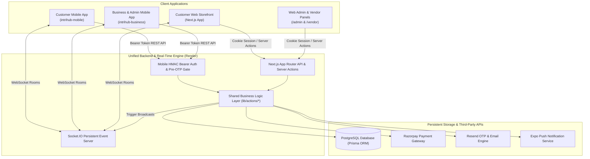
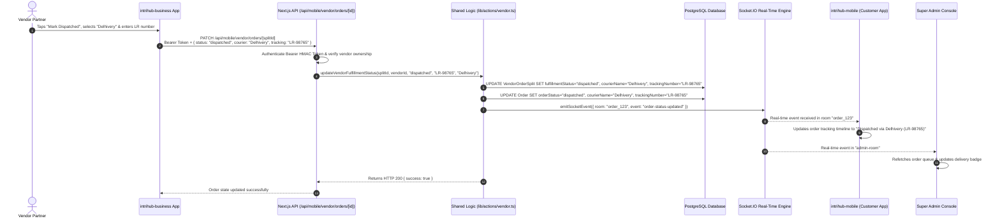

# Intrihub System Architecture & Engineering Guide

---

## 1. High-Level Overview

**Intrihub** (Tiletra) is a centralized B2B and B2C marketplace platform for tiles, sanitaryware, electricals, and building materials. The platform unifies four distinct client-facing surfaces into a single shared backend, database, and real-time event pipeline:

1. **Customer Web Storefront**: Public marketplace for browsing, estimating tile coverage, cart volume-tier discounts, and purchasing.
2. **Website Admin & Vendor Web Panels**: Web-based portals for Super Admins (`/admin`) and approved Vendor Partners (`/vendor`).
3. **Customer Mobile Application (`intrihub-mobile`)**: React Native / Expo iOS & Android app for end-users and contractors.
4. **Business & Admin Mobile Application (`intrihub-business`)**: Dual-persona mobile app providing a Vendor Management Portal and a 5-tab Super Admin Console.



---

## 2. Backend Architecture (`tiletra` Repository)

### 2.1 Technology Stack
- **Framework**: Next.js 15+ (App Router)
- **Database & ORM**: PostgreSQL hosted on cloud database services, queried via **Prisma ORM**
- **Authentication**:
  - Web: Session cookies via **Better Auth**
  - Mobile: HMAC-SHA256 signed Bearer tokens with 3-attempt/15-minute brute-force lockout
- **Payment Processing**: **Razorpay** SDK with webhook and client-side signature verification
- **Real-Time Layer**: Persistent **Socket.IO** server running alongside Next.js
- **Email Delivery**: **Resend** transactional email API for OTP verification and invoices
- **Push Notifications**: **Expo Server SDK** for device push dispatch
- **Hosting**: **Render Web Service** (`intrihub.onrender.com` mapped to `intrihub.com` / `www.intrihub.com`)

---

### 2.2 Directory Structure
```text
Intrihub/
├── app/                                 # Next.js App Router tree
│   ├── (auth)/                          # Web customer auth routes (login, register, forgot-password)
│   ├── (shop)/                          # Public storefront routes (browse, category, product detail)
│   ├── account/                         # Customer web account, profile, addresses, orders
│   ├── admin/                           # Web Super Admin Portal (/admin/*)
│   │   ├── deliveries/                  # Centralized logistics tracking & dispatch pool
│   │   ├── orders/                      # Super admin master order management
│   │   ├── product-approvals/           # Vendor product review & rejection workflow
│   │   ├── products/                    # Global product catalog & bulk CSV importer
│   │   └── vendors/                     # Vendor applications, onboarding & KYC
│   ├── vendor/                          # Web Vendor Partner Portal (/vendor/*)
│   │   ├── orders/                      # Vendor order fulfillment & courier tracking
│   │   ├── payouts/                     # Settlements, lifetime earnings & bank details
│   │   ├── products/                    # Vendor inventory & stock management
│   │   └── settings/                    # Vendor shop profile & delivery method
│   ├── api/
│   │   ├── auth/                        # Better Auth web cookie endpoints
│   │   ├── mobile/                      # Mobile-specific REST API Gateway
│   │   │   ├── admin/                   # Super Admin endpoints (dashboard, vendors, orders, items)
│   │   │   ├── auth/                    # Mobile OTP, Google login, and pre-OTP security whitelist
│   │   │   ├── orders/                  # Customer mobile order creation, Razorpay verify, tracking
│   │   │   ├── push-token/              # Device push token registration & test triggers
│   │   │   ├── user/                    # Customer profile, addresses, and wishlist
│   │   │   └── vendor/                  # Vendor dashboard, products, fulfillment, and profile
│   │   └── webhooks/                    # Razorpay payment webhooks
│   └── layout.tsx                       # Root web layout & providers
├── components/                          # Reusable web React components
├── lib/                                 # Shared Business Logic & Infrastructure
│   ├── actions/                         # Core domain actions (reused across Web & Mobile)
│   │   ├── admin-vendor.ts              # Admin approval workflows & KYC actions
│   │   ├── email-otp.ts                 # OTP generation, Resend dispatch, and verification
│   │   ├── orders.ts                    # Order creation, inventory deduction, split logic
│   │   ├── payouts.ts                   # Financial settlements and payout calculations
│   │   ├── products.ts                  # Catalog CRUD, search, and category taxonomy
│   │   └── vendor.ts                    # Vendor scoping, fulfillment, and profile updates
│   ├── formatters.ts                    # Data transformers and Prisma DTO mappers
│   ├── mobile-auth.ts                   # Bearer token verification and role guards
│   ├── prisma.ts                        # Global Prisma client singleton
│   ├── rate-limit.ts                    # In-memory sliding window rate limiter
│   └── socket-server-emit.ts            # Bridge to trigger Socket.IO room events
├── prisma/
│   └── schema.prisma                    # Relational database schema
└── socket-server.ts                     # Standalone / integrated Socket.IO server instance
```

---

### 2.3 The "Reuse Business Logic" Architecture Pattern
To prevent divergence between the website and mobile applications, all core business logic is encapsulated in `lib/actions/*`.

- **Web Routes**: Server Components and Server Actions call `lib/actions/*` directly.
- **Mobile Routes**: The `/api/mobile/*` REST controllers authenticate the request via Bearer tokens and delegate execution directly to the same functions in `lib/actions/*`.

```text
[Web Server Action]  ──┐
                       ├──> [ lib/actions/orders.ts: createOrder() ] ──> [ PostgreSQL ]
[Mobile POST API]     ──┘
```

---

### 2.4 Security & Access Perimeter
1. **Pre-OTP Vendor Gate**: When a user inputs an email into `intrihub-business`, `POST /api/mobile/auth/send-otp` verifies that the email corresponds to an approved `Vendor` record (or `admin@intrihub.com`) **before** generating any OTP or returning success. Unknown emails receive HTTP 403 `NOT_FOUND`.
2. **Single-Admin Restriction**: Administrative access (`role: "admin"`) is strictly restricted to `admin@intrihub.com`.
3. **Brute-Force Rate Limiting**: Mobile authentication endpoints enforce a 3-attempt / 15-minute lockout cooldown tracked by IP and identifier.
4. **Vendor Data Isolation**: All vendor actions require a verified `vendorId` and validate that the requesting user owns the vendor entity.

---

### 2.5 Real-Time Socket.IO Pipeline
- **Connection**: Persistent WebSocket connection with fallback to HTTP long-polling.
- **Rooms**:
  - `order_{orderId}`: Joined by the ordering customer and Super Admin for real-time tracking updates.
  - `vendor_{vendorId}`: Receives instant notifications on new assigned order splits.
  - `admin-room`: Receives real-time marketplace metrics and new order alerts.
- **Key Events**:
  - `order-status-updated`: Fired when fulfillment status, courier partner, or LR tracking number updates.
  - `vendor-order-updated`: Fired when a vendor marks an item ready for pickup or dispatched.

---

## 3. Customer Mobile App (`intrihub-mobile`)

### 3.1 Technology Stack
- **Framework**: React Native with **Expo SDK 52+** and **Expo Router**
- **State Management**: **Zustand** (persisted Cart store, Auth store, Address store)
- **Data Fetching**: **TanStack React Query** with background cache invalidation
- **UI & Icons**: Vanilla StyleSheet with design tokens (`COLORS`, `SPACING`, `RADIUS`), **Lucide Icons**
- **Payment SDK**: **react-native-razorpay** custom checkout bridge
- **Push Notifications**: **expo-notifications** with automated device token registration

---

### 3.2 Directory Structure
```text
intrihub-mobile/
├── app/                                 # Expo Router file-based screens
│   ├── (auth)/                          # Mobile login, OTP verification, register
│   ├── (tabs)/                          # Bottom tab navigation
│   │   ├── index.tsx                    # Home feed (Banners, Categories, Trending)
│   │   ├── explore.tsx                  # Search & catalog filtering
│   │   ├── cart.tsx                     # Shopping cart & volume tier discounts
│   │   ├── orders.tsx                   # Customer order history & live status
│   │   └── profile.tsx                  # Profile settings, addresses, support
│   ├── checkout.tsx                     # Address picker, payment selector, Razorpay flow
│   ├── order/
│   │   └── [id].tsx                     # Live real-time order tracking timeline & invoice
│   └── product/
│       └── [slug].tsx                   # Product detail, finish selector, tile calculator
├── src/
│   ├── api/                             # Axios client & typed API endpoints (catalog, orders, auth)
│   ├── components/                      # Reusable mobile UI components (Cards, Modals, Badges)
│   ├── constants/                       # Theme colors, typography, layout constants
│   ├── hooks/                           # Custom React hooks (usePushNotifications, useLocation)
│   ├── store/                           # Zustand stores (useCartStore, useAuthStore)
│   ├── types/                           # TypeScript interfaces for products, orders, cart
│   └── utils/                           # PDF invoice generator, currency formatters
├── app.json                             # Expo application configuration & plugins
└── package.json
```

---

## 4. Business & Admin Mobile App (`intrihub-business`)

### 4.1 Technology Stack & Dual-Persona Architecture
`intrihub-business` dynamically renders one of two distinct application interfaces depending on the authenticated account role:

1. **Vendor Partner View (`app/(vendor)/*`)**: For approved merchants to manage inventory, fulfill assigned order splits, and view financial earnings.
2. **Super Admin Console (`app/(admin)/*`)**: Full marketplace control for `admin@intrihub.com`.

---

### 4.2 Super Admin 5-Tab Navigation Structure
```text
[Dashboard] ──> Platform GMV, Order Totals, Active Vendors, Quick Metric Cards
[Vendors]   ──> Approved Vendors, KYC Verification, Pending Applications, Manual Add
[Items]     ──> Global Products, Approval Queue (Approve/Reject with Reason), Categories, Bulk CSV
[Orders]    ──> Master Order Pool, Delivery Tracking, Centralized Platform Logistics
[Account]   ──> Coupon Manager, Promo Banners, Platform Rates, Policies, Partner Support
```

---

### 4.3 Directory Structure
```text
intrihub-business/
├── app/
│   ├── (auth)/                          # Login, 6-digit OTP verification
│   ├── (admin)/                         # Super Admin Console
│   │   ├── _layout.tsx                  # 5-Bottom-Tab Layout (Dashboard, Vendors, Items, Orders, Account)
│   │   ├── dashboard.tsx                # Master marketplace analytics & overview
│   │   ├── vendors.tsx                  # Vendor management, KYC, applications, auto-publish
│   │   ├── products.tsx                 # Product catalog & approval review queue
│   │   ├── orders.tsx                   # Master order fulfillment & status updater
│   │   ├── deliveries.tsx               # Central platform delivery fleet management
│   │   ├── categories.tsx               # Category & subcategory taxonomy manager
│   │   ├── content.tsx                  # Coupons & promotional banners
│   │   ├── profile.tsx                  # Admin settings, platform rates, support
│   │   ├── vendor/[id].tsx              # Detailed vendor partner overview & store audit
│   │   └── order/[id].tsx               # Admin order detail & courier assignment modal
│   └── (vendor)/                        # Vendor Partner Portal
│       ├── _layout.tsx                  # 5-Bottom-Tab Layout (Dashboard, Items, Orders, Earnings, Store)
│       ├── dashboard.tsx                # Vendor sales, revenue, low-stock alerts
│       ├── products.tsx                 # Product list with Rejection Reason banners & filters
│       ├── add-product.tsx              # Multi-variant product listing form with Color Palette
│       ├── product/[id].tsx             # Edit product specifications & pricing
│       ├── orders.tsx                   # Order fulfillment with 1-tap courier dispatch modal
│       ├── order/[id].tsx               # Order details & tracking status
│       ├── profile.tsx                  # Store settings & Logistics Mode (Manual vs Auto)
│       └── support.tsx                  # Dedicated vendor partner support center
├── src/
│   ├── api/                             # Typed API connectors (admin.ts, vendor.ts, auth.ts)
│   ├── components/                      # ColorPalettePickerModal, StatusBadges, InvoiceModal
│   ├── constants/                       # logistics.ts (Courier Partners), catalog.ts, theme.ts
│   └── utils/                           # invoicePrinter.ts, formatters
├── app.json
└── package.json
```

---

## 5. End-to-End Request Lifecycle Example

### Scenario: Vendor Marks an Order as Dispatched with LR Tracking Number



---

## 6. Environments & Configuration Reference

### 6.1 Backend (`tiletra`) Environment Variables (`.env`)
| Variable Name | Purpose |
|---|---|
| `DATABASE_URL` | PostgreSQL direct / pooled database connection URI |
| `NEXT_PUBLIC_APP_URL` | Public web storefront base URL |
| `MOBILE_JWT_SECRET` | HMAC-SHA256 signing secret for mobile Bearer access tokens |
| `ADMIN_ALLOWED_EMAIL` | Whitelisted email for Super Admin permissions (`admin@intrihub.com`) |
| `RESEND_API_KEY` | Transactional email API key for 6-digit OTP delivery |
| `RAZORPAY_KEY_ID` | Razorpay public key ID for checkout initialization |
| `RAZORPAY_KEY_SECRET` | Razorpay webhook & verification secret key |
| `EXPO_ACCESS_TOKEN` | Expo Server SDK token for push notification dispatch |

---

### 6.2 Mobile Applications (`intrihub-mobile` & `intrihub-business`) (`.env`)
| Variable Name | Purpose |
|---|---|
| `EXPO_PUBLIC_API_URL` | Production backend API endpoint (`https://www.intrihub.com`) |
| `EXPO_PUBLIC_SOCKET_URL` | Persistent Socket.IO WebSocket server endpoint (`https://www.intrihub.com`) |
| `EXPO_PUBLIC_RAZORPAY_KEY_ID` | Razorpay merchant key ID for custom native checkout |

---

## 7. Known Engineering Constraints & Lessons Learned

1. **Persistent WebSocket Server on Render**:
   - Vercel's serverless runtime terminates short-lived execution contexts, breaking persistent Socket.IO connections. Render hosts the unified Node.js runtime, supporting permanent WebSocket connections for live order tracking.
2. **Native Module Builds (EAS Build vs Expo Go)**:
   - Native packages (`react-native-razorpay`, `expo-notifications`) require compilation into standalone Android APKs and iOS binaries. Running them inside standard Expo Go will fail due to missing native bridges.
3. **Server-Driven Pricing & Tier Validation**:
   - Volume tier discounts and delivery fees are calculated on the backend during order creation to prevent client-side price tampering.
4. **Strict Pre-OTP Whitelisting**:
   - Unapproved emails are intercepted at the `send-otp` step to ensure random or unverified accounts cannot reach the verification screen or generate unauthorized database records.
